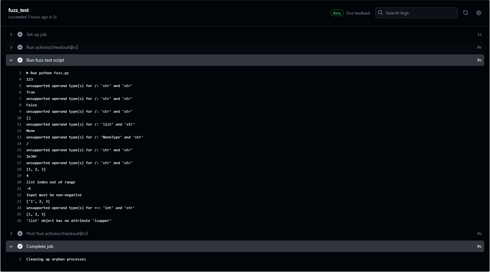
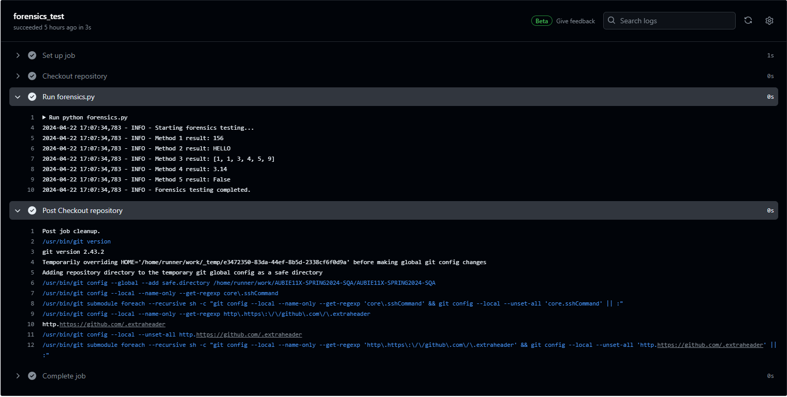
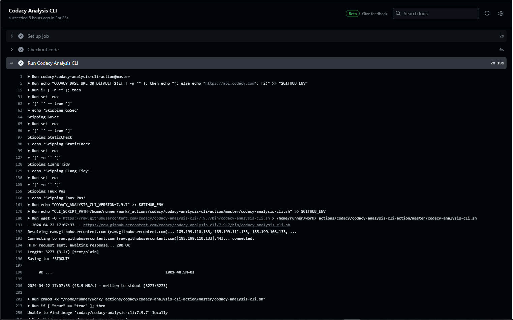
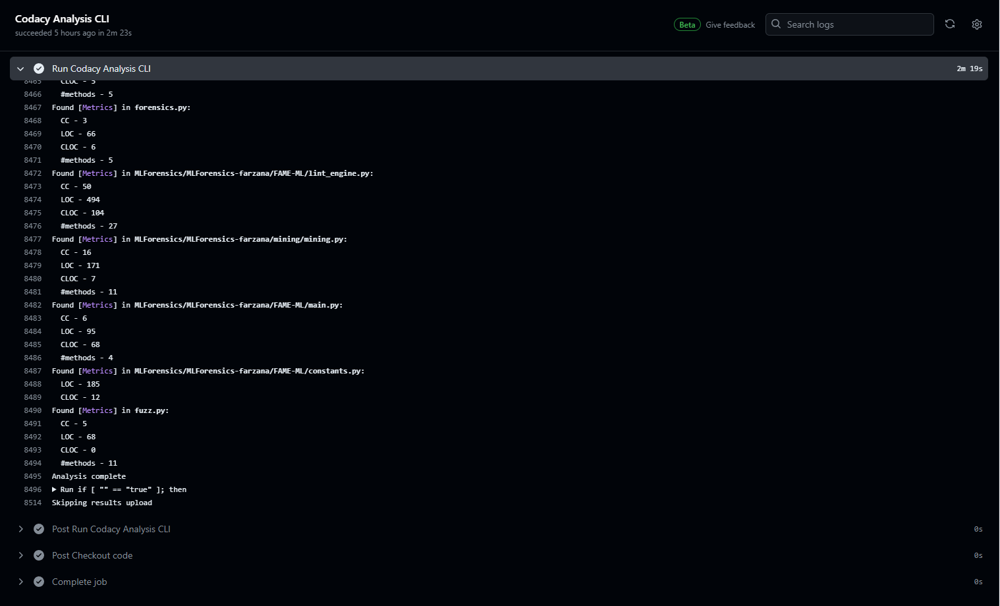

<!-- Intro -->
# SQA Final Project

## Team info
**Team name** 

Aubie11x

**Team Members**

John Chen 

Ben Hulsey 

Micah Key

William Bingham 

<!-- Body -->
## Objective
The objective of this project is to integrate software quality assurance activities into an existing Python project. Whatever we learned from our workshops will be integrated in the project.

## Activities
1. Unpack the project `MLForensics.zip`. (1%)
    * we were able to successfully unpack the project from the [Github](https://github.com/paser-group/continuous-secsoft/blob/master/sqa-spring2024/project/MLForensics.zip).

2. Upload project as a GitHub repo on `github.com`. Format the repo name is `TEAMNAME-SPRING2024-SQA` (2%)
    * we have a shared Github repository, the link can be found in the shared signup sheet or [here](https://github.com/coolsocks1/AUBIE11X-SPRING2024-SQA).

3. In your project repo create `README.md` listing your team name and team members. (2%)
    * On the home page of the [Github Repo](https://github.com/coolsocks1/AUBIE11X-SPRING2024-SQA) our `README.md` can be found, the file contians our team name, team members, and basic details of the project.

4. Apply the following activities related to software quality assurance:

    - 4.a. Create a Git Hook that will run and report all security weaknesses in the project in a CSV file whenever a Python file is changed and committed. (20%)
        * We created a Git hook that runs and reports all security weaknesses when code is pushed to the repository, these weakness are logged to `weaknesses.csv`
         found [here](https://github.com/coolsocks1/AUBIE11X-SPRING2024-SQA/blob/main/weaknesses.csv).

    - 4.b. Create a `fuzz.py` file that will automatically fuzz 5 Python methods of your choice. Report any bugs you discovered by the `fuzz.py` file. `fuzz.py` will be automatically executed from GitHub actions. (20%)
        * This file fuzzes 5 methods in `fuzz.py` and gives us a report
        
        * In this step, we learned how to better implement testing code through the use of fuzzy.

    - 4.c. Integrate forensics by modifying 5 Python methods of your choice. (20%)
        * In `forensics.py` we edited the 5 methods to allow for logging info to be tested.
        
        * In this step, we learned how to implement logging in python to help test/debug our code at diffrent points in our code.

    - 4.d. Integrate continuous integration with GitHub Actions. (20%)
        * We set up Codacity Analysis, similar to [Workshop 8](https://github.com/paser-group/continuous-secsoft/tree/master/sqa-spring2024/workshops/workshop8-ci) by implementing `codacy-analysis.yml`, located in the [.github/workflows](https://github.com/coolsocks1/AUBIE11X-SPRING2024-SQA/tree/main/.github/workflows) directory.
        
        ...
        
        * In this step, we learned how to run Codacy Analysis against our repo to test
    
5.  Report your activities and lessons learned. Put the report in your repo as `REPO.md` (15%)
    * The team has completed all the assignments and pushed to our [Public Github Repo](https://github.com/coolsocks1/AUBIE11X-SPRING2024-SQA)